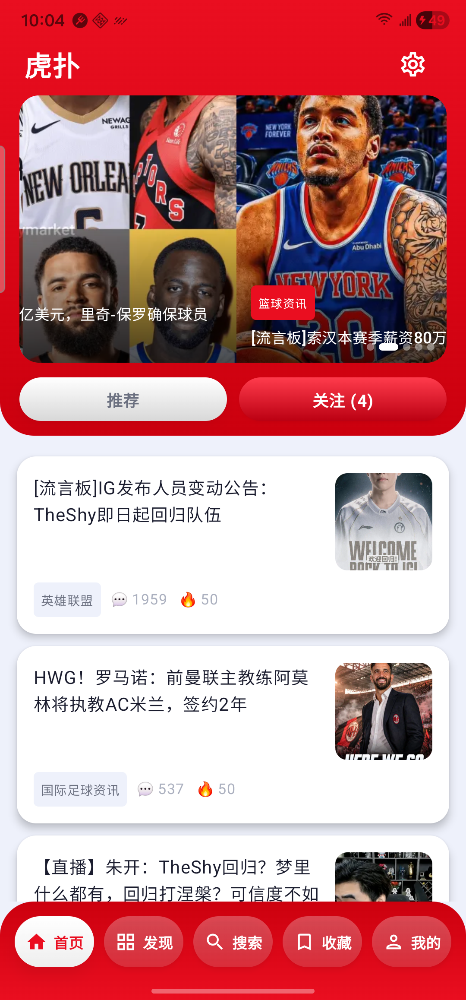

# 虎扑 X

一个用 Jetpack Compose 编写的虎扑第三方 Android 客户端，界面简洁、无广告、无推送骚扰。
---

---

## 功能

### 首页
- **推荐**：从虎扑首页聚合热门帖子，顶部轮播图展示图文内容
- **关注**：汇总所有已关注专区的最新动态，按时间排序
- 右上角设置入口

### 发现
- 浏览全部专区分类（篮球、足球、综合等）
- 进入专区查看帖子列表，支持下拉加载更多
- **发帖（需要登录）**：进入任意专区后右下角显示发帖按钮，填写标题（4-40字）和正文即可发布到当前专区

### 搜索
- 关键词搜索帖子

### 收藏
- 一键收藏帖子，本地持久化存储，离线可用

### 帖子详情
- 正文通过 WebView 渲染，完整显示图片（含 hupu 自定义 `<center class="hupu-img">` 格式）和视频（HTML5 `<video>`）
- 点击任意图片弹出**全屏查看器**：双指捏合缩放（最高 8×）、拖动平移、单击关闭
- 动图（GIF）在查看器内自动循环播放
- 评论列表，显示楼主标识、引用回复、点赞数；评论中的图片可点击放大
- 点击「X 条回复」展开子回复面板（ModalBottomSheet）
- 子回复支持**无限递归展开**，可层层深入查看嵌套回复，并可逐层返回
- 收藏 / 取消收藏
- **分享**：点击右上角分享按钮，将帖子标题与移动端链接分享至其他应用
- **回复（需要登录）**：
  - 评论卡片底部显示「回复」按钮，点击弹出原生回复面板，显示引用内容与输入框
  - 帖子正文卡片底部显示「回复主贴」按钮，支持直接回复楼主
  - 子回复面板内的回复同样支持「回复」按钮
  - 回复通过桌面版 API 提交，支持成功提示与错误反馈
  - 未登录时以上回复按钮全部隐藏

### 我的（需要登录）
- 头像、昵称、等级、地区、注册时长
- 关注 / 粉丝 / 发帖 / 推荐 / 赞 / 声望 统计
- **我的发帖**：显示本人发布的所有帖子，含专区、摘要、回复/点亮/推荐数，触底自动加载
- **我的回帖**：显示本人所有回帖内容，含引用块，触底自动加载
- **我的推荐**：显示本人推荐过的帖子列表，含专区标签，触底自动加载
- **我关注的专区**：横滑展示关注的专区，点击直接进入专区帖子列表
- **消息中心**：三个 Tab——提到我的、评论、亮了/推荐，显示发送者头像、内容摘要、所在帖子标题；亮了 Tab 额外显示累计亮了数
- 点击帖子、回帖、推荐均可跳转到帖子详情页

### 导航体验
- **双击 Tab 回顶**：在首页或发现页再次点击底部导航图标，列表平滑滚回顶部；首页区分推荐 / 关注子页面各自独立滚顶
- **二次返回退出**：在主页面连续两次返回（2 秒内）才退出应用，防止误触

### 登录与设置
- **WebView 登录**：内嵌浏览器打开虎扑登录页，登录成功后自动提取 Cookie
- **手动 Cookie**：在设置中直接粘贴从浏览器复制的 Cookie 字符串，优先级高于 WebView 登录
- 清除登录一键退出

---

## 技术栈

| 层级 | 技术 |
|---|---|
| 语言 | Kotlin |
| UI | Jetpack Compose + Material 3 |
| 架构 | MVVM（ViewModel + StateFlow） |
| 依赖注入 | Hilt |
| 本地数据库 | Room |
| 网络 | OkHttp |
| 数据解析 | Gson（JSON API）、Jsoup（HTML） |
| 图片加载 | Coil + coil-gif（GIF / 动图支持） |
| 导航 | Navigation Compose |
| Cookie 持久化 | SharedPreferences |

### 数据来源

| 接口类型 | 说明 |
|---|---|
| 移动端 SSR（`m.hupu.com`） | 首页、专区列表、专区详情、帖子详情，解析页面内 `__NEXT_DATA__` JSON |
| 桌面端 SSR（`bbs.hupu.com`） | 登录后帖子评论列表（解析 `__NEXT_DATA__`，每页 20 条） |
| 桌面端 REST API（`bbs.hupu.com/api/v2/`） | 子回复列表 |
| 桌面端 REST API（`bbs.hupu.com/pcmapi/`） | 提交回复、发帖 |
| 桌面端 REST API（`my.hupu.com/pcmapi/`） | 个人资料、我的发帖、我的回帖、我的推荐、消息中心（需 Cookie） |
| 桌面端 HTML（`my.hupu.com`） | 关注专区列表（Jsoup 解析）、消息中心初始数据（解析 `window.$$data`） |

详细 API 文档见 [`doc/api/`](doc/api/README.md)。

桌面端 slug 与移动端 topicId 的对应关系（254 个专区）通过解析 `www.hupu.com` 的 `hotSearchData` 生成并硬编码，无需运行时额外请求。

---

## 项目结构

```
app/src/main/java/com/hupux/
├── data/
│   ├── local/          # Room 数据库（收藏、关注专区）+ CookiePreferences
│   ├── model/          # 数据模型（Post、Zone、Comment、UserProfile 等）
│   ├── repository/     # 数据仓库层（Home / Post / Zone / Profile / Favorites）
│   └── scraper/
│       ├── HupuScraper.kt          # 移动端数据抓取
│       ├── HupuDesktopScraper.kt   # 桌面端数据抓取（需 Cookie）
│       └── ZoneSlugMap.kt          # 桌面 slug → 移动 topicId 映射表
├── di/
│   └── AppModule.kt    # Hilt 依赖注入模块
└── ui/
    ├── home/           # 首页（推荐 + 关注）
    ├── zone/           # 发现 + 专区详情
    ├── post/           # 帖子详情 + 评论
    ├── search/         # 搜索
    ├── favorites/      # 收藏
    ├── profile/        # 我的（个人资料 + 回帖 + 推荐 + 关注专区 + 消息中心 + WebView 登录）
    ├── settings/       # 设置（手动 Cookie）
    ├── navigation/     # 底部导航 + 路由
    └── theme/          # 颜色、主题（支持深色模式）
```

---

## 环境要求

- Android Studio Hedgehog 或更新版本
- JDK 17
- Android SDK：minSdk **26**（Android 8.0）/ targetSdk **35**
- Gradle 8.x（通过项目自带的 Wrapper 自动管理）

---

## 构建与运行

```bash
# 克隆仓库
git clone https://github.com/你的用户名/hupuX.git
cd hupuX

# 直接用 Android Studio 打开，或命令行构建 Debug 包
./gradlew assembleDebug
```

生成的 APK 位于 `app/build/outputs/apk/debug/`。

---

## 免责声明

本项目为个人学习用途，数据来源于虎扑（hupu.com）公开页面。请勿用于任何商业目的。
