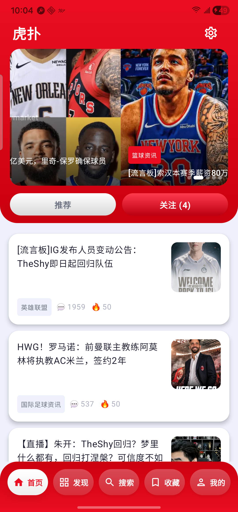

# 虎扑 X

一个基于 **Kotlin Multiplatform** 的虎扑第三方客户端，同时支持 **Android**、**iOS** 和 **桌面端（macOS / Windows / Linux）**。界面简洁、无广告、无推送骚扰。

- **Android / 桌面端**：Compose Multiplatform 界面
- **iOS**：原生 SwiftUI 界面，复用同一套 KMP 业务逻辑（`Shared.framework`）

---



---

## 平台支持

| 功能 | Android | iOS | 桌面端 |
|---|:---:|:---:|:---:|
| 浏览（首页/热榜/关注/专区/话题/搜索） | ✅ | ✅ | ✅ |
| 帖子详情（正文图文/视频 + 评论） | ✅ | ✅ | ✅ |
| 楼中楼递归展开 / 评论排序 | ✅ | ✅ | ✅ |
| 登录（WebView / 粘贴 Cookie） | ✅ | ✅ | ✅ |
| 点赞 / 收藏 / 推荐 / 回复（带图） | ✅ | ✅ | ✅ |
| 发帖（图片 / 视频，OSS 直传） | ✅ | ✅ | ⚠️ 只读 |
| 我的 / 子列表 / 消息中心 | ✅ | ✅ | ✅ |
| 图片全屏查看 / 长按保存相册 | ✅ | — | — |

---

## 功能

### 首页
- **推荐**：从虎扑首页聚合热门帖子，顶部图片轮播展示图文内容
- **热榜**：展示虎扑热榜话题（按热度排名），点击话题进入其帖子列表，再点帖子进入详情
- **关注**：汇总所有已关注专区的最新动态
- 右上角设置入口

### 发现
- 浏览全部专区分类（篮球、足球、综合等）
- 进入专区查看帖子列表，支持加载更多
- **关注专区（需要登录）**：专区详情页右上角「关注」按钮
- **发帖（需要登录）**：进入任意专区后显示发帖入口，填写标题和正文即可发布；支持图片 / 视频上传

### 搜索
- 关键词搜索帖子

### 收藏
- 一键收藏帖子，本地持久化存储，离线可用

### 帖子详情
- 正文完整显示图片（含虎扑自定义 `<center class="hupu-img">` 格式）与视频
- Android / iOS：WebView（WKWebView）渲染正文，支持 HTML5 `<video>`
- 评论列表：用户头像、楼主标识、引用回复、点赞数、评论内嵌图片
- **评论排序**：正序 / 倒序 / 最热（按点亮数）
- 点击「X 条回复」展开子回复面板，支持**无限递归嵌套展开**
- **收藏 / 推荐 / 回复 / 点赞（需要登录）**：登录后自动切换桌面版 API 解锁；回复支持插图
- **回复签名**：设置中可自定义回复末尾自动追加的签名
- Android：图片点击全屏查看（双指缩放 / GIF），长按保存至相册

### 我的（需要登录）
- 头像、昵称、等级、地区、注册时长、统计数据
- **我的发帖 / 回帖 / 推荐**：分页加载
- **消息中心**：回复 / @我 / 点亮，三个分类

### 登录
- WebView 登录（登录成功自动提取 Cookie）
- 设置中直接粘贴从浏览器复制的 Cookie 字符串（进入设置会回显当前 Cookie）

### 设置 → 关于
- **检查更新**：对比 GitHub 最新 release 的版本号，有新版可一键跳转下载页

---

## 技术栈

### 共享层（`shared`，编译到 Android / iOS / 桌面端）

| 层级 | 技术 |
|---|---|
| 语言 | Kotlin Multiplatform |
| 网络 | **Ktor Client**（Android/Desktop：OkHttp 引擎；iOS：Darwin 引擎） |
| JSON 解析 | **kotlinx.serialization** |
| HTML 解析 | **Ksoup** |
| 本地数据库 | SQLDelight（Android/Desktop：JDBC/Android driver；iOS：Native driver） |
| 依赖注入 | Koin（Android/Desktop）；iOS 用手工装配 `IosDependencies` |
| 时间 | kotlinx-datetime |

### 各端 UI

| 平台 | UI | 说明 |
|---|---|---|
| Android | Jetpack Compose + Material 3 | Navigation Compose、Coil 3、WebView |
| 桌面端 | Compose Desktop | Coil 3 |
| iOS | **SwiftUI（原生）** | WKWebView（正文/登录）、CryptoKit（OSS 上传签名）、AsyncImage |

> iOS 端通过 `Shared.framework` 调用共享的 scraper / repository；Kotlin 的 `suspend` 函数在 Swift 侧自动桥接为 `async/await`。

### 数据来源

| 接口类型 | 说明 |
|---|---|
| 移动端 SSR（`m.hupu.com`） | 首页、专区、帖子详情，解析 `__NEXT_DATA__` JSON；**未登录默认走此接口** |
| 桌面端 SSR / REST（`bbs.hupu.com`） | **登录后自动切换**：评论列表、子回复、收藏、点赞、推荐、回复、发帖 |
| 桌面端 REST（`my.hupu.com/pcmapi/`） | 个人资料、我的发帖/回帖/推荐、消息中心（需 Cookie） |
| 虎扑图床 + 阿里云 OSS | 发帖 / 回复插图与视频上传（STS 临时凭证直传，OSS V1 手动签名） |

详细 API 文档见 [`doc/api/`](doc/api/README.md)。

---

## 项目结构

```
hupuX/
├── shared/                    # KMP 共享模块（Android / iOS / 桌面端）
│   └── src/
│       ├── commonMain/kotlin/com/hupux/data/
│       │   ├── model/         # 数据模型
│       │   ├── repository/    # 数据仓库层
│       │   └── scraper/       # HupuScraper（移动端）、HupuDesktopScraper（桌面端）
│       ├── androidMain/       # Android 平台实现（ioDispatcher 等）
│       ├── desktopMain/       # 桌面平台实现
│       └── iosMain/kotlin/com/hupux/ios/
│           ├── IosCookieStorage.kt   # NSUserDefaults Cookie 存储
│           └── IosDependencies.kt    # iOS 依赖装配（暴露给 Swift）
│
├── app/                       # Android 模块（Compose）
├── desktopApp/                # 桌面端模块（Compose Desktop）
└── ios/                       # iOS 模块（SwiftUI，独立 Xcode 工程）
    └── HupuX/HupuX/
        ├── HupuXApp.swift / RootView.swift    # 入口 + 底部 Tab
        ├── HomeView / ZoneListView / SearchView / FavoritesView / ProfileView
        ├── PostDetailView / ZoneDetailView / TopicDetailView / MessageView
        ├── NewPostView / SettingsView / LoginWebView
        ├── HupuUploader.swift                 # 图片/视频 OSS 上传（CryptoKit 签名）
        └── Deps.swift / Session.swift / Routes.swift / Theme.swift
```

---

## 环境要求

| 平台 | 要求 |
|---|---|
| Android | Android Studio + JDK 17；minSdk 26（Android 8.0）/ targetSdk 35 |
| 桌面端 | JDK 17；macOS / Windows / Linux |
| iOS | **Xcode 16+**（macOS）；部署目标 iOS 16+ |

---

## 构建与运行

```bash
git clone https://github.com/bidabrain/hupuX.git
cd hupuX

# Android：构建 Debug 包（APK 位于 app/build/outputs/apk/debug/）
./gradlew :app:assembleDebug

# 桌面端：运行 / 打包
./gradlew :desktopApp:run
./gradlew :desktopApp:packageDmg   # macOS .dmg
./gradlew :desktopApp:packageMsi   # Windows .msi
./gradlew :desktopApp:packageDeb   # Linux .deb
```

### iOS（⚠️ 无签名，需自行签名安装）

> **iOS 客户端不包含开发者签名。** 本项目未加入 Apple Developer Program，CI 产出的是**未签名的 `.ipa`**，**无法直接安装到 iPhone**，需要你用自己的 Apple ID 自行签名后侧载。

**方式一：Xcode 直装（推荐，免费 Apple ID 即可）**

1. 用 Xcode 打开 `ios/HupuX/HupuX.xcodeproj`
2. 选中 **HupuX** target → **Signing & Capabilities** → 勾选 *Automatically manage signing*，Team 选你自己的 Apple ID（Personal Team）
3. 连接 iPhone，顶部选中你的设备，**Cmd + R** 直接编译安装

> 首次编译会自动通过 Run Script 调 Gradle 生成 `Shared.framework`（`./gradlew :shared:embedAndSignAppleFrameworkForXcode`），无需手动操作。

**方式二：侧载现成的未签名 `.ipa`**

1. 从 [Releases](https://github.com/bidabrain/hupuX/releases) 下载 `HupuX-unsigned.ipa`
2. 用 **Sideloadly** / **AltStore** 等工具，输入你的 Apple ID 签名并安装到 iPhone

> 免费 Apple ID 签名的 App 有效期为 **7 天**，到期需重新签名；付费开发者账号为 1 年。

**命令行编译（模拟器，无需签名）**

```bash
cd ios/HupuX
xcodebuild -project HupuX.xcodeproj -scheme HupuX \
  -sdk iphonesimulator \
  -destination 'platform=iOS Simulator,name=iPhone 16' \
  build CODE_SIGNING_ALLOWED=NO
```

---

## 发布流程（CI）

推送到 `main` 后由 GitHub Actions 全自动完成，**不需要手动改版本号**：

1. 纯文档改动（`**.md` / `doc/**` / 仓库配图）**不触发** CI；
2. 触发后先算出新版本号（默认 patch +1，如本次推送自己改了 `appVersion` 则以手动值为准）；
3. 用该版本号构建 Android / macOS(ARM+Intel) / Windows / Linux / iOS 六个产物；
4. **全部成功后**才把版本号写回 `gradle.properties` 与 iOS 的 `project.pbxproj`，
   并发布 GitHub Release `v<版本号>`。构建失败则仓库保持不变，不会留下没有 release 的版本号。

想发 minor/major 版本时，手动把 `gradle.properties` 的 `appVersion` 改成目标版本再推即可
（`appVersionCode` 忘了改也没关系，CI 会自动 +1，保证 Android 能覆盖安装）。

---

## Star History

<a href="https://www.star-history.com/?type=date&repos=bidabrain%2FhupuX">
 <picture>
   <source media="(prefers-color-scheme: dark)" srcset="https://api.star-history.com/chart?repos=bidabrain/hupuX&type=date&theme=dark&legend=top-left" />
   <source media="(prefers-color-scheme: light)" srcset="https://api.star-history.com/chart?repos=bidabrain/hupuX&type=date&legend=top-left" />
   
 </picture>
</a>

---

## 免责声明

本项目为个人学习用途，数据来源于虎扑（hupu.com）公开页面。请勿用于任何商业目的。
